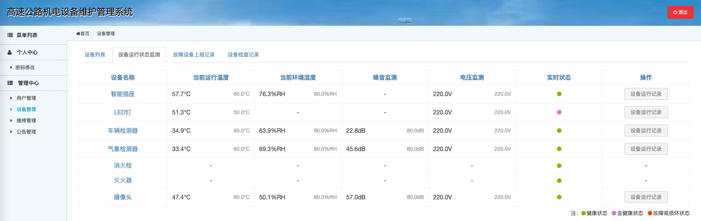

## 二次开发的基于原生 Java Web 开发的机电设备管理系统

### 💡 项目简介

> 接手项目时，很多结构已经定型，比如以中文拼音命名的类名、实体类字段以及数据库库表字段等，为保持一致，遂采用了与原项目一致的命名风格。

该项目使用的后端技术为原生 Servlet、Filter，后端使用 JSP 与 JSTL 的组合，我接手后，在部分文件引入了 Vue 3 与 ElementPlus。

我的工作主要是对原项目的流程优化和功能闭环。主要工作：1）划分权限；2）加入维修流程；3）设备模拟监测。

### 🔗 已完成工作

- 用户管理
- 设备管理
- 维修管理
- 公告管理
- 设备运行状态模拟监测

### ↪️ 待添加功能

- 无，项目已完结。

### ⤵️ 部分截图

